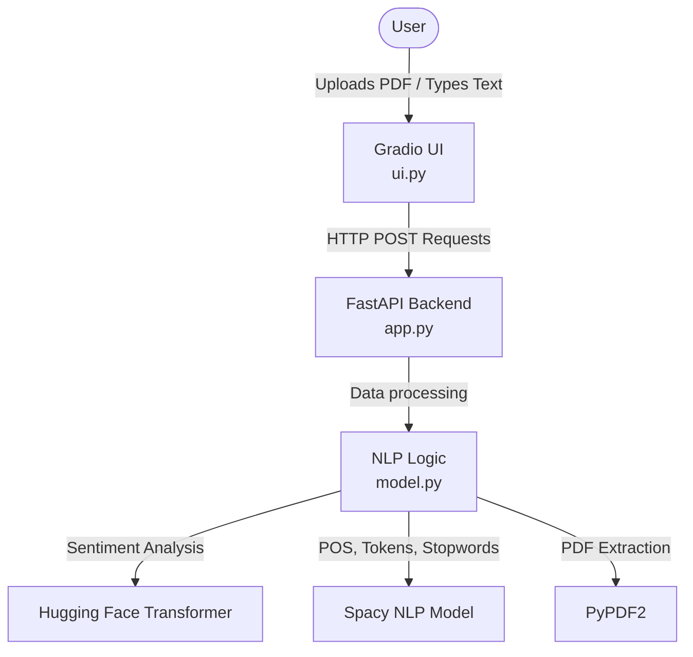

# NeuroText Analytics Engine

A unified intelligence platform for analyzing, processing, and understanding text data.

This project is a modular Natural Language Processing (NLP) toolkit built with Python, FastAPI, Hugging Face Transformers, Spacy, and Gradio.

## 🚀 Features

- **🎭 Sentiment Analysis**: Powered by Hugging Face Transformers. Provides overall text sentiment as well as a detailed line-by-line sentence breakdown (Positive/Negative) with confidence scores.
- **🏷️ Part-of-Speech (POS) Tagging**: Uses `spacy` to break down sentences and identify grammatical structures (nouns, verbs, adjectives, etc.).
- **🌱 Lemmatization**: Extracts the core root dictionary form of every word (e.g., "running" becomes "run").
- **🏢 Named Entity Recognition (NER)**: Instantly identifies People, Organizations, Locations, Dates, and more from the text.
- **🔠 Tokenization**: Extracts and separates individual words while simultaneously counting total tokens and punctuation marks.
- **🛑 Stopword Removal**: Cleans raw text by stripping out common, low-value words (like "the", "is", "at") to highlight important keywords.
- **📄 PDF Support**: Upload any PDF file directly into the dashboard to automatically extract its text and run it through the NLP pipelines.

## 🏗️ Application Architecture

The system is separated into a frontend dashboard and a backend REST API, allowing the AI models to be accessed by multiple different applications if needed.



## ⚙️ Installation

1. Clone the repository:
```bash
git clone https://github.com/khushi-sharma2506/NeuroText-Analytics-Engine.git
cd NeuroText-Analytics-Engine
```

2. Install the required dependencies:
```bash
pip install -r requirements.txt
```

3. Download the Spacy English model:
```bash
python -m spacy download en_core_web_sm
```

## ▶️ Running the Application

The toolkit requires both the backend API and the frontend UI to be running simultaneously.

### Step 1: Start the FastAPI Backend
Open a terminal in the project directory and run:
```bash
python -m uvicorn app:app --reload
```
The API will run at `http://127.0.0.1:8000`. You can view the interactive API documentation at `http://127.0.0.1:8000/docs`.

### Step 2: Start the Gradio Dashboard
Open a **second** terminal and run:
```bash
python ui.py
```
The interface will be available at `http://127.0.0.1:7860`. Open this address in your web browser to start analyzing text!

## 🔌 API Endpoints

The FastAPI backend exposes the following REST endpoints for external applications:

- `POST /predict`: Analyzes sentiment. Returns overall sentiment and line-by-line breakdown.
- `POST /pos`: Returns a list of words with their corresponding Part-of-Speech tags.
- `POST /lemmatization`: Returns the root dictionary form for each word.
- `POST /ner`: Identifies and returns named entities (organizations, people, locations).
- `POST /tokens`: Returns an array of text tokens and a punctuation count.
- `POST /stopwords`: Returns the cleaned text and an array of the removed stopwords.

## 👨‍💻 Developed By

**Khushi Sharma**  
B.Tech CSE (AI & ML), Graphic Era Deemed to be University
